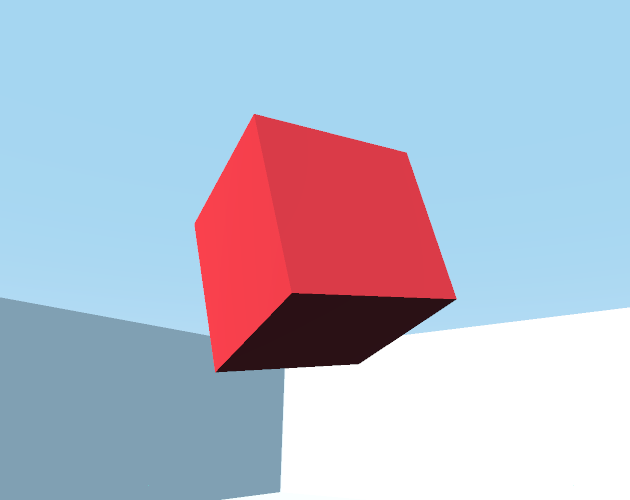

# Chat Cube

A demo using the Godot game engine where you talk to a cube. Uses Deepgram for speech-to-text, Cleverbot as a chat bot, and Elevenlabs for text-to-speech.

  

Hosted on itch.io here: https://browncanstudios.itch.io/chat-cube
